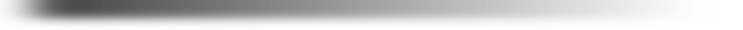

**v2 Introduces more stagger and death animations, fake ragdolls of a kind, its a lot and its very cool, you can see some of it in action in the video below**

<!-- nexus-raw: [youtube]GPr29jKNFYI[/youtube] -->

## 💃 GIFs GIFs GIFs

## 💃 Installation

* Install the dependency [Max Yari's Script Services (MSS)](https://www.nexusmods.com/morrowind/mods/60256) (Most of my lua mods require it now, should come BEFORE all my mods in the load order, you can just move it at the very top of your list, no harm in that).
* Install this mod **With a mod organiser**: Download this repository as an archive and drag and drop it into your mod organiser of choice (e.g [Mod Organizer 2](https://github.com/ModOrganizer2/modorganizer/releases) on Windows or [Nerevarine Organizer](https://github.com/grazelandsnomad/nerevarine_organizer/releases/tag/v0.70) on Linux). **Or**: [read this tutorial](https://modding-openmw.com/tips/installing-mods/) on how to install mods using the launcher or completely manually (it's also very easy).
* Enable the mod's .omwscript file in "Content Files" tab of the OpenMW launcher.

---

Thanks to folks in OpenMW discord for supporting my shenanigans and helping when OpenMW lua docs give up on being understandable.

Hit them hard!

